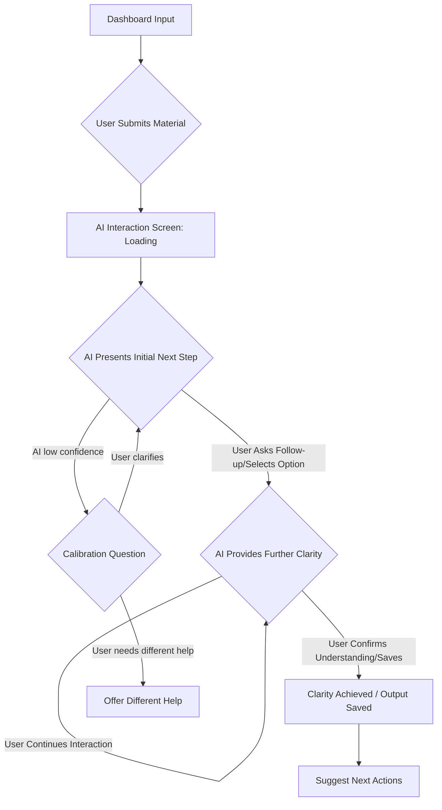
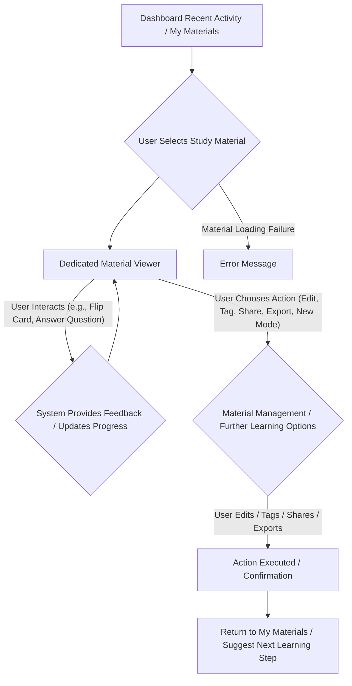

# The AI Helping Tool UX Design Specification

_Created on Thursday, 4 December 2025 by BIP_
_Generated using BMad Method - Create UX Design Workflow v1.0_

---

## Executive Summary

The AI Helping Tool, or "Zero-Friction Instant Clarity Engine," is designed to empower university and college students by transforming their study experience. It aims to reduce cognitive load, enhance active engagement, and provide immediate, context-aware guidance through AI-powered study assistance. This web application will help students plan curricula, summarize difficult material, and offer instant feedback or explanations, ultimately improving productivity and reducing academic stress. This UX design will focus on delivering a user experience that embodies these principles, making complex AI interactions feel intuitive and supportive.

---

## 1. Design System Foundation

### 1.1 Design System Choice

To provide a robust, accessible, and intuitive foundation for "The AI Helping Tool," we will leverage a modern design system.

**Design System Options Explored:**

1.  **Material UI:** A comprehensive React UI framework implementing Google's Material Design.
    *   **Key Strengths:** Extensive component library, strong accessibility features out-of-the-box (WCAG compliant), well-documented, large community support, and highly customizable to fit brand.
    *   **Best for:** Projects requiring a polished, modern aesthetic with robust functionality and a focus on user experience best practices.
2.  **Chakra UI:** A simple, modular, and accessible component library for React applications.
    *   **Key Strengths:** Highly accessible by default, excellent theming capabilities, developer-friendly API, and good responsiveness.
    *   **Best for:** Projects where accessibility is paramount and custom branding is desired without sacrificing development speed.
3.  **shadcn/ui:** A collection of re-usable components built using Radix UI and Tailwind CSS.
    *   **Key Strengths:** Provides maximum flexibility for styling, very lightweight, highly performant, and modern approach to component development.
    *   **Best for:** Projects needing absolute control over visual appearance and performance, with developers comfortable with Tailwind CSS.

**Recommendation:**

My recommendation is to proceed with **Material UI**. This choice aligns best with the project's goals by offering a comprehensive suite of accessible components, ensuring a high quality user experience from the start. Its extensive documentation and community support will also benefit development efficiency. This system can be customized to achieve our unique brand personality while benefiting from proven patterns.

**Design System Decision:**

*   **System:** Material UI
*   **Version:** Latest Stable (assuming 2025 version)
*   **Rationale:** Chosen for its comprehensive component library, strong accessibility features, and ease of customization, providing a solid and efficient foundation for a web application targeting students. It balances speed of development with adherence to UX best practices and accessibility requirements.
*   **Provides:** Standard UI components (buttons, forms, modals, navigation, etc.), built-in accessibility (WCAG), theming, responsive patterns, icon library.
*   **Customization needs:** Will require custom theming to align with the unique brand personality of "The AI Helping Tool" rather than a generic Material Design look.

---

## 2. Core User Experience

### 2.1 Defining Experience

The defining experience of "The AI Helping Tool" is that **"It's the app that gives you the single, most helpful next step to understand anything in your study material."**

This core interaction is novel. It transcends traditional search or summarization by actively interpreting user intent and context to provide a personalized, actionable micro-task or insight. This pattern aims to minimize cognitive load and maximize learning efficiency by always guiding the user towards their most productive next move in their study journey.

### 2.2 Novel UX Patterns

The **Single Most Helpful Next Step** interaction is novel - no single established pattern fully encompasses its AI-driven, context-aware guidance.

Core UX challenge: The system needs to accurately infer user intent and emotional state from diverse study material inputs, then provide an actionable, minimal-friction response that genuinely advances the user's learning, all while maintaining a "zero-friction" feel.

Let's think through the core mechanics of this **Single Most Helpful Next Step** interaction:

1.  **User Goal:** The user's primary goal is to quickly gain clarity, overcome confusion, or make tangible progress on their study material, moving from a state of being stuck to a clear, actionable path.
2.  **Trigger:** The interaction is initiated when the user provides study material input (text, image, etc.) to the system. The system then automatically processes this input, often without explicit command beyond the initial submission.
3.  **Feedback:** Users should experience rapid, near-instantaneous processing feedback. A single, clear suggestion or targeted question should appear, conveying a sense of immediate progress or presenting a clear path forward. The feedback should feel precise and relevant.
4.  **Success:** Users know the interaction succeeded when they achieve understanding, receive an actionable task that resolves their confusion, or feel empowered to confidently take the next physical or mental next step in their learning process.
5.  **Errors:** If the system misinterprets intent or provides an unhelpful step, recovery is designed to be low-friction. The system will provide a subtle calibration question or offer alternative interpretations to guide the user back on track, maintaining a low-friction experience.

---

## 3. Visual Foundation

### 3.1 Color System

The visual foundation for "The AI Helping Tool" will be built upon the "Vibrant Engagement" color theme and complemented by a clear and readable typography system, and a robust spacing and layout foundation.

**Color System:**

*   **Chosen Theme:** Vibrant Engagement
*   **Rationale:** This theme, characterized by its energetic blues, oranges, and clean contrast, aims to stimulate active engagement and make the learning process feel dynamic and less monotonous. It aligns with the emotional goal of making learning feel engaging and inspiring, while maintaining clarity.
*   **Semantic Usage:**
    *   **Primary:** `#007bff` (e.g., main calls to action, prominent interactive elements)
    *   **Secondary:** `#fd7e14` (e.g., supporting actions, complementary information)
    *   **Success:** `#28a745` (e.g., positive feedback, successful actions)
    *   **Error:** `#dc3545` (e.g., critical alerts, input validation errors)
    *   **Warning:** `#ffc107` (e.g., important but non-critical notices)
    *   **Info:** `#17a2b8` (e.g., general information, tips)
    *   **Neutral Palette:** A range of light grays (`#f8f9fa` for light background, `#e9ecef` for dark background) and dark text (`#212529`) ensures readability and a vibrant yet clean aesthetic.

**Interactive Visualizations:**

- Color Theme Explorer: [ux-color-themes.html](./ux-color-themes.html)

---

## 4. Design Direction

### 4.1 Chosen Design Approach

### Design Direction Decision

The chosen design direction is a hybrid approach, combining "Focused Input" for the dashboard/home screen and "Conversational Flow AI Interaction" for the core AI interaction. This selection is driven by the project's core principle of "Instantaneous Clarity" and the goal of providing an engaging and guided interaction for the "Single Most Helpful Next Step".

**Chosen Direction:** Hybrid: Direction 1 "Focused Input" (Dashboard) + Direction 4 "Conversational Flow" (AI Interaction)

**Layout Decisions:**
*   **Navigation Pattern (Dashboard):** Left sidebar for main application navigation, complemented by a subtle top bar for account actions (e.g., profile, settings). This keeps the primary content area clean while offering persistent navigation access.
*   **Content Structure (Dashboard):** Central, prominent input area on the dashboard to immediately prompt user interaction. Recent activities and materials are displayed below or to the side, maintaining context without diverting focus from the main task.
*   **Content Organization (AI Interaction):** A chat-like interface where user inputs and AI responses are displayed in a linear, conversational flow, using bubbles to differentiate between speaker.

**Hierarchy Decisions:**
*   **Visual Density:** A balanced visual density for the conversational flow, ensuring readability and ease of following the conversation. For the dashboard, a spacious density will be maintained.
*   **Header Emphasis:** Clear and concise headers will be used to guide the user and indicate conversation topics.
*   **Content Focus:** The primary focus will be on the conversational exchange, with clear distinction between user input and AI guidance.

**Interaction Decisions:**
*   **Primary Action Pattern:** Direct input submission (e.g., text area with a clear button) will be the primary action driver on the dashboard. For the AI interaction screen, input will be via a text field, and the "next step" will be presented as the AI's response within the conversational thread, potentially with inline actionable buttons or choices.
*   **Information Disclosure:** Information in the conversational flow will be disclosed progressively as the dialogue unfolds. On the dashboard, key recent items are shown, with deeper dives available on click.
*   **User Control:** Users have clear control over their input and can drive the conversation. The AI guides the path through its responses.

**Visual Style Decisions:**
*   **Weight:** A balanced visual weight, using the vibrant engagement theme colors to make the interaction engaging, while maintaining clarity and readability.
*   **Depth Cues:** Subtle depth cues (e.g., soft shadows on chat bubbles or cards) will differentiate elements and make the interface feel modern and interactive.
*   **Border style:** Subtle borders will define input fields and structural elements, enhancing clarity within the vibrant theme.

**Rationale:** This hybrid approach combines the efficiency of a dedicated input mechanism (dashboard) with the intuitive and familiar interaction of a conversational AI (AI interaction screen). The "Focused Input" dashboard ensures that initiating the core AI interaction is effortless, while the "Conversational Flow" for the AI screen aligns with the user's desire for an AI chatbot-like experience (like Gemini), reducing the learning curve and making AI guidance feel natural and approachable. This effectively supports the desired emotional responses of empowerment, productivity, and confidence through engaging interaction.

**Interactive Mockups:**

- Design Direction Showcase: [ux-design-directions.html](./ux-design-directions.html)

---

## 5. User Journey Flows

### 5.1 Critical User Paths

We have designed four critical user journeys that cover the core interactions within "The AI Helping Tool." Each flow is designed to be intuitive, efficient, and supportive of the user's learning goals, aligning with our defined UX principles and chosen design directions.

### User Journey: Getting Clarity on a Concept

**User Goal:** To quickly gain understanding or resolve confusion about a specific concept within their study material.
**Current entry point:** The Dashboard's prominent input area.

**Chosen Approach:** Guided Flow (Conversational)

**Flow Steps:**

1.  **Step 1: User Initiates Clarity Request (Dashboard)**
    *   User sees: Dashboard with a clear, central input area (textarea).
    *   User does: Pastes text, uploads a file, or types a question into the input area, then clicks "Get Clarity" (or similar primary action).
    *   System responds: Transitions to the AI Interaction Screen, showing a brief loading/processing indicator.
2.  **Step 2: AI Presents Initial Next Step (AI Interaction Screen)**
    *   User sees: Conversational interface. User's input is displayed as a chat bubble. The AI's initial response (the "Single Most Helpful Next Step") appears as another chat bubble, often as a clarifying question or a direct, concise explanation.
    *   User does: Reads the AI's response and the suggested next step. If it's a question, they type an answer or select an option.
    *   System responds: Processes user's interaction.
3.  **Step 3: Iterative Clarification (AI Interaction Screen)**
    *   User sees: The conversation continues. AI provides further explanations, examples, or breaks down complex ideas based on user's previous responses, always maintaining the "single next step" principle. This may involve presenting flashcards, mini-quizzes, or concept links inline.
    *   User does: Continues to interact with the AI, asking follow-up questions, providing more context, or selecting guided options.
    *   System responds: Delivers tailored, real-time guidance.
4.  **Step 4: User Achieves Clarity / Saves Output (AI Interaction Screen)**
    *   User sees: Clear understanding of the concept. The AI might offer to summarize the conversation or generate study material (e.g., a flashcard) based on the clarified concept.
    *   User does: Confirms understanding, saves generated material, or exits the conversation.
    *   System responds: Confirms save, provides confirmation of clarity, and gently suggests next actions (e.g., "Would you like to explore a related topic?").

**Decision Points:**

*   **Initial AI Interpretation:** If AI confidence is low, present a calibration question rather than a definitive answer.
*   **User Misunderstanding:** If user feedback indicates misunderstanding, AI branches to provide more foundational explanation.

**Error States:**

*   **Unclear Input:** AI politely asks for clarification or rephrasing (e.g., "I'm not sure I understand. Could you rephrase your question?").
*   **Processing Error:** Display a simple, non-disruptive error message and suggest re-trying or contacting support.

**Success State:**

*   **Completion feedback:** User expresses understanding or confirms task completion (e.g., "Got it!"), or saves generated study material.
*   **Next action:** AI suggests related topics, prompts for further study material input, or offers to generate comprehensive study aids.



---

### User Journey: Generating Study Materials (e.g., Flashcards)

**User Goal:** To efficiently create structured study materials like flashcards from their raw or clarified study content.
**Current entry point:** The Dashboard's input area or within an ongoing AI conversation.

**Chosen Approach:** Guided Flow (Conversational), integrating seamlessly with the AI interaction.

**Flow Steps:**

1.  **Step 1: User Initiates Material Generation (Dashboard or AI Conversation)**
    *   **User sees:** Either the Dashboard's central input for direct material submission, or the AI conversation interface where they have discussed a concept.
    *   **User does:**
        *   **Direct:** Inputs study material with an explicit request (e.g., "Generate flashcards from this text").
        *   **Conversational:** Responds to an AI prompt (e.g., "Would you like me to create flashcards for this concept?").
    *   **System responds:** Displays a brief, non-disruptive "Generating..." indicator.
2.  **Step 2: AI Presents Generated Material (AI Interaction Screen)**
    *   **User sees:** The generated study material (e.g., a set of interactive flashcards, a concise summary, quiz questions) presented directly within the conversational flow, or a clear link to a dedicated material viewing area.
    *   **User does:** Reviews the generated material.
    *   **System responds:** Asks for feedback ("Are these flashcards helpful?") and offers clear subsequent actions (e.g., "Save to My Materials," "Edit," "Generate a Quiz").
3.  **Step 3: User Reviews and Refines (AI Interaction Screen / Dedicated View)**
    *   **User sees:** The generated material, with options for direct editing or conversational refinement.
    *   **User does:**
        *   Edits the material directly.
        *   Requests modifications through the AI conversation (e.g., "Make these flashcards more detailed on 'Quantum Entanglement'").
            *   Accepts the material as-is.
        *   Navigates to a comprehensive "My Materials" view for broader management.
    *   **System responds:** Applies direct edits, or regenerates/modifies the material based on conversational feedback, or confirms the user's acceptance.
4.  **Step 4: User Saves Material & Plans Next Steps (AI Interaction Screen / My Materials)**
    *   **User sees:** Clear confirmation that the material has been saved.
    *   **User does:** Confirms the save.
    *   **System responds:** Provides options for further engagement (e.g., "Start a study session with these flashcards?", "Add to a study plan," "Explore related topics").

**Decision Points:**

*   **Generation Type:** AI offers different types of material based on user prompt or inferred need (flashcards, summary, quiz).
*   **Iterative Refinement:** User can iteratively refine generated material through conversation.

**Error States:**

*   **Insufficient Input:** If the provided material is too brief or ambiguous, the AI will politely request more context (e.g., "I need a bit more text to generate comprehensive flashcards. Could you provide a longer passage?").
*   **Generation Failure:** In case of a rare processing error, a simple, non-disruptive message will appear, guiding the user to retry or suggest an alternative generation method.

**Success State:**

*   **Completion Feedback:** The user successfully saves the desired study material to their personal library.
*   **Next Action:** The AI suggests immediate, relevant follow-up actions, such as starting a study session with the new material, generating a quiz, or continuing to explore related concepts, maintaining seamless learning continuity.

```mermaid
graph TD
    A[Dashboard Input / AI Conversation (Request Material)] --> B{AI Processes & Generates Material};
    B --> C{AI Presents Generated Material (e.g., Flashcards)};
    C -- User Reviews & Provides Feedback --> D{User Edits / Requests AI Modifications};
    D -- AI Regenerates / Applies Edits --> C;
    C -- User Satisfied --> E[Material Saved to "My Materials"];
    E --> F[AI Suggests Next Learning Actions];

    B -- Insufficient Input --> G{AI Requests More Context};
    G -- User Provides More --> A;
    B -- Generation Failure --> H[Error Message / Suggest Retry];
```

---

### User Journey: Reviewing Generated Study Materials

**User Goal:** To effectively review and manage their previously AI-generated summaries, flashcards, or quiz questions to reinforce learning.
**Current entry point:** The Dashboard's "Recent Activity" section or the dedicated "My Materials" library.

**Chosen Approach:** Direct access with contextual actions, supporting efficient review and management.

**Flow Steps:**

1.  **Step 1: User Accesses Saved Materials (Dashboard / My Materials Library)**
    *   **User sees:** An organized view of their personalized study materials, either a curated "Recent Activity" list on the dashboard or a comprehensive "My Materials" section with filtering and sorting options.
    *   **User does:** Selects a specific item from their library (e.g., a set of flashcards, a summary document) to review.
    *   **System responds:** Instantly loads and displays the chosen material within a dedicated viewer optimized for that content type.
2.  **Step 2: User Reviews Material (Dedicated Viewer - e.g., Flashcard Interface)**
    *   **User sees:** The study material clearly presented.
        *   For **Flashcards:** The front of a card (term/question) is displayed with options to "Flip" for the answer, "Mark as Learned/Unlearned" options, navigation controls (next/previous card).
        *   For **Summaries:** Readable text, potentially with interactive elements (e.g., clickable key terms for quick definitions).
        *   For **Quizzes:** Question presentation, input fields for answers, "Submit" button.
    *   **User does:** Interacts with the material (e.g., flips cards, reads summaries, answers quiz questions).
    *   **System responds:** Provides immediate feedback for quizzes (correct/incorrect), updates learning progress for flashcards.
3.  **Step 3: User Manages or Continues Learning (Contextual Options / Editor)**
    *   **User sees:** Contextual options related to the current material.
    *   **User does:**
        *   Edits the material (FR17).
        *   Applies tags or categorization (FR18) for better organization.
        *   Initiates sharing with classmates (FR21) or exports the material (FR23).
        *   Chooses to transition into another learning mode (e.g., "Quiz me on this summary," "Practice these flashcards").
        *   Returns to "My Materials" library or the Dashboard.
    *   **System responds:** Executes the chosen action, providing appropriate feedback (e.g., "Saved changes," "Shared successfully," "Starting quiz").

**Decision Points:**

*   **Learning Mode Selection:** User can choose different learning modes for flashcards (e.g., learn, review, test).
*   **Material Action:** User decides whether to modify, share, or export the material.

**Error States:**

*   **Material Loading Failure:** If a saved material cannot be loaded, a user-friendly error message will inform the user and suggest next steps (e.g., retry, contact support).
*   **Save/Edit Conflicts:** (Future consideration for collaborative features) Implement mechanisms for version control or conflict resolution for concurrent edits.

**Success State:**

*   **Completion Feedback:** The user successfully reviews, understands, and effectively manages their study materials, fostering a sense of control over their learning.
*   **Next Action:** The system intelligently suggests related activities, such as continuing their review session, exploring new materials, or engaging in a practice quiz, maintaining seamless learning continuity.



---

### User Journey: Account Creation & Login

**User Goal:** To securely create a personal account and gain authenticated access to their tailored study environment and saved materials.
**Current entry point:** The application's landing page or a dedicated login/signup screen.

**Chosen Approach:** Streamlined and secure multi-option authentication flow.

**Flow Steps:**

1.  **Step 1: User Initiates Account Action (Landing Page / Auth Screen)**
    *   **User sees:** Prominent calls to action on the landing page (e.g., "Get Started," "Log In") or is directed to a clear authentication screen offering both "Sign Up" and "Log In" options.
    *   **User does:** Selects either "Sign Up" to create a new account or "Log In" to access an existing one.
    *   **System responds:** Presents the appropriate form or selection of authentication methods.
2.  **Step 2: User Provides Credentials (Registration / Login Form)**
    *   **User sees:**
        *   **Sign Up:** Input fields for email, desired password (with confirmation), and options for Single Sign-On (SSO) providers (e.g., Google, Apple).
        *   **Log In:** Input fields for email and password, alongside SSO options and a "Forgot Password" link.
    *   **User does:** Enters their details or selects their preferred SSO provider.
    *   **System responds:**
        *   **Sign Up:** Performs client-side validation, then initiates account creation and sends a verification email.
        *   **Log In:** Performs client-side validation, then attempts server-side authentication.
    3.  **Step 3: Account Verification / Authentication (Email Verification / Server Check)**
        *   **User sees:**
            *   **Sign Up:** A clear message instructing them to check their email for a verification link.
            *   **Log In:** A brief loading indicator.
        *   **User does:**
            *   **Sign Up:** Clicks the unique verification link in their email.
            *   **Log In:** Awaits authentication completion.
        *   **System responds:**
            *   **Sign Up:** Confirms email verification and activates the account.
            *   **Log In:** Authenticates the user and establishes a secure session.
    4.  **Step 4: Successful Access & Onboarding (Dashboard)**
        *   **User sees:** A welcoming success message (e.g., "Welcome to The AI Helping Tool, BIP!") and is smoothly redirected to their personalized dashboard.
        *   **User does:** Begins exploring their study environment, potentially guided by a lightweight onboarding tour if it's their first login.
        *   **System responds:** Displays the dashboard, ready for user interaction, potentially pre-populated with initial guidance or recent activity.

    **Decision Points:**

    *   **Authentication Method Choice:** Users can opt for the convenience of SSO or the control of traditional email/password, with clear UI indicators for each.
    *   **Password Reset/Recovery:** A clear, secure flow for password recovery is accessible from the login screen.

    **Error States:**

    *   **Invalid Credentials (Login):** "Incorrect email or password. Please try again." Feedback is immediate and non-blocking, allowing quick correction.
    *   **Weak Password (Signup):** "Password does not meet requirements. Please ensure it has at least 8 characters, one uppercase, one number, and one special character." Requirements are clearly stated.
    *   **Email Already Registered (Signup):** "An account with this email already exists. Please log in or use the 'Forgot Password' option."
    *   **Account Not Verified (Login):** "Your account is not yet verified. Please check your email for the verification link or resend."

    **Success State:**

    *   **Completion Feedback:** The user is securely logged in and gains immediate access to their personalized study dashboard, feeling confident and ready to learn.
    *   **Next Action:** The system guides the user toward their primary goal – providing study material for clarity – or offers a quick overview of new features.

    ```mermaid
    graph TD
        A[Landing Page / Initial Screen] --> B{User Clicks "Sign Up" / "Log In"};
        B -- "Sign Up" --> C[Registration Form: Email/Password/SSO];
        C -- User Submits Details --> D{System Validates & Sends Verification Email};
        D -- User Clicks Email Link --> E[Account Verified];
        E --> F[Dashboard / Welcome];

        B -- "Log In" --> G[Login Form: Email/Password/SSO];
        G -- User Submits Credentials --> H{System Authenticates};
        H -- Success --> F;
        H -- Failure (Invalid Credentials) --> I[Error Message on Login Form];
        I --> G;
        D -- Failure (Email Exists) --> J[Error Message / Prompt Login/Reset];
        J --> G;
    ```

---

## 6. Component Library

### 6.1 Component Strategy

Our strategy for the component library will be to leverage the robust foundation provided by **Material UI**, customizing and extending it where necessary to meet the unique requirements of "The AI Helping Tool." This approach balances development efficiency with the need for a distinct and highly functional user experience.

**Components Provided by Material UI (Standard Usage):**

*   **Navigation & Layout:** `AppBar` (for top bars), `Drawer` (for left sidebar on desktop), `BottomNavigation` (for mobile navigation), `Grid` and `Container` (for responsive layouts).
*   **Input & Controls:** `TextField` (for general text input, search), `Button`, `IconButton`, `Checkbox`, `Radio`, `Select`, `Slider`.
*   **Feedback & Communication:** `Snackbar` / `Alert` (for success/error messages), `Dialog` / `Modal` (for confirmations and specific workflows), `CircularProgress` / `LinearProgress` (for loading states).
*   **Data Display:** `Card` (for displaying recent activity, generated materials), `List` (for materials library), `Avatar`, `Chip`, `Badge`).

**Custom Components Needed (or heavily customized):**

1.  **AI Conversation Bubble/Message Component**
    *   **Purpose:** To intuitively display AI responses and user inputs in a chat-like, engaging, and visually distinct manner within the "Conversational Flow."
    *   **Why Custom:** Material UI offers basic text display, but a rich conversational interface requires custom styling for bubbles (e.g., tail, distinct background colors for user/AI), inline interactive elements (buttons, links), and subtle AI indicators (e.g., "typing...").
    *   **Anatomy:** Message text, sender indicator (avatar/icon), timestamp, inline actionable elements.
    *   **States:** User message, AI message (explanation, question, suggestion), loading/typing indicator, error.
    *   **Variants:** Text-only message, message with embedded choices (buttons), message with rich content (e.g., compact flashcard preview).

2.  **Interactive Study Material Viewer (Flashcard Component)**
    *   **Purpose:** To provide a dedicated, engaging interface for reviewing AI-generated flashcards, supporting active recall effectively.
    *   **Why Custom:** While Material UI has `Card` components, a functional flashcard requires specific interactive states (flip animation), learning progress tracking (mark learned/unlearned), and navigation controls tailored for a study session.
    *   **Anatomy:** Card container, front content area, back content area, flip button, navigation controls, learning status indicator.
    *   **States:** Front displayed, Back displayed, Marked as Learned, Marked as Unlearned, Loading.
    *   **Variants:** Basic text flashcard, flashcard with rich media (image/audio), multi-choice answer selection.

3.  **Dynamic Input Area / "Smart Prompt"**
    *   **Purpose:** To serve as the primary, "zero-friction" gateway for users to submit diverse study materials (text, files, spoken questions) and initiate AI analysis.
    *   **Why Custom:** This component needs to intelligently adapt its UI based on input type (textarea, file drop zone), provide contextual hints, and potentially integrate speech-to-text input. Its dynamism goes beyond a standard `TextField`.
    *   **Anatomy:** Resizable text area, file upload icon/drop zone, clear "Submit" or "Analyze" button, contextual hint text.
    *   **States:** Empty, Text entered, File pending upload, File uploaded, Processing, Error.
    *   **Variants:** Default text input, drag-and-drop file input mode, dedicated question-asking mode.

**Components Requiring Heavy Customization:**

*   **Buttons:** All standard Material UI buttons will undergo significant theming to match the "Vibrant Engagement" color palette and ensure high visual impact and clear hierarchy (primary, secondary, destructive actions).
*   **Forms & Input Fields:** Standard Material UI `TextField` and other form elements will be styled and extended to support advanced validation feedback, integrated hints, and contextual assistance relevant to inputting study material.

---

## 7. UX Pattern Decisions

### 7.1 Consistency Rules

To ensure a consistent, intuitive, and "zero-friction" experience across "The AI Helping Tool," we've established clear guidelines for common UX patterns. These decisions are informed by Material UI defaults, our "Vibrant Engagement" theme, and the specific needs of our beginner-level student users.

**Pattern Categories & Decisions:**

1.  **Button Hierarchy:**
    *   **Decision:** Utilize Material UI's `Contained` buttons for primary actions (filled with Primary color), `Outlined` buttons for secondary actions (border in Primary color), and `Text` buttons for tertiary/less prominent actions. Destructive actions will use the designated error color (`#dc3545`).
    *   **Rationale:** Provides a clear visual language, guiding users to the most important actions and preventing choice overload.

2.  **Feedback Patterns:**
    *   **Decision:**
        *   **Success:** Non-intrusive `Snackbar`/`Toast` messages appearing temporarily at the bottom of the screen.
        *   **Error:** Inline error messages directly below relevant form fields for validation issues. Persistent `Alert` banners at the top of a screen/section for critical, non-contextual errors.
        *   **Warning:** `Alert` banners to inform users of potential issues or important, non-blocking information.
        *   **Loading:** `CircularProgress` (spinners) for component-level loading, `LinearProgress` for full-page or section-wide loading. Skeleton loaders for content areas to reduce perceived latency.
    *   **Rationale:** Delivers immediate and clear feedback without disrupting the user's flow, aligning with "Enlightening Reinforcement."

3.  **Form Patterns:**
    *   **Decision:** Labels positioned `above` input fields for maximum readability and accessibility. Real-time validation will occur `onBlur` for simple fields and `onSubmit` for complex forms, with clear, concise inline error messages. Contextual help text will be provided via `tooltips` on info icons or as `caption text` below fields.
    *   **Rationale:** Enhances clarity, reduces user errors, and provides immediate feedback.

4.  **Modal Patterns:**
    *   **Decision:** Material UI `Dialog` components will be used for focused tasks or critical confirmations. Standardized sizes (small, medium, large) will be used appropriately. Modals will be dismissible via an explicit `Close` button (X icon) and/or clicking outside the modal backdrop. Focus will automatically shift to the first interactive element within the modal for accessibility.
    *   **Rationale:** Ensures consistent user experience for focused tasks or important information, ensuring accessibility.

5.  **Navigation Patterns:**
    *   **Decision:** Active navigation items (in the left sidebar or mobile bottom navigation) will be clearly indicated with a distinct background color and/or a primary color text/icon. Breadcrumbs for deeper hierarchical navigation flows. The browser's back button behavior will be supported, complemented by in-app back buttons for specific multi-step workflows.
    *   **Rationale:** Clear user orientation and control, aligning with "Empathetic Nudge."

6.  **Empty State Patterns:**
    *   **Decision:** Empty states (e.g., a "My Materials" section with no saved items) will feature encouraging messages with a primary call-to-action guiding the user on how to get started (e.g., "No materials yet! Add your first study text to begin.").
    *   **Rationale:** Prevents confusion and encourages feature adoption, particularly important for a beginner audience.

7.  **Confirmation Patterns:**
    *   **Decision:**
        *   **Destructive Actions (e.g., Delete Material):** Require explicit user confirmation via a modal dialog that clearly outlines the action and its irreversible impact.
        *   **Unsaved Changes:** Users will be warned via an in-app modal if they attempt to navigate away from an editing context with unsaved changes, offering options to save, discard, or cancel.
    *   **Rationale:** Prevents accidental data loss and provides users with a sense of security and control.

8.  **Notification Patterns:**
    *   **Decision:** `Snackbar`/`Toast` for transient system notifications (success, info, minor warning). Persistent `Alert` components will be used for critical notifications that require user attention or action, positioned prominently at the top of the relevant context.
    *   **Rationale:** Informs users effectively without interrupting their workflow, with appropriate urgency for different types of messages.

9.  **Search Patterns:**
    *   **Decision:** A dedicated search bar will be available in the top app bar or within relevant content sections. Search results will feature instant feedback (e.g., predictive text, filtered lists) as the user types. "No results found" messages should offer suggestions.
    *   **Rationale:** Efficient information retrieval, aligning with "Instantaneous Clarity."

10. **Date/Time Patterns:**
    *   **Decision:** Use relative time for recent activity (e.g., "5 minutes ago," "Yesterday"). Absolute date/time will be used for creation/modification stamps. All times will be displayed in the user's local timezone. Material UI date/time pickers will be used for consistent date/time input.
    *   **Rationale:** Provides user-friendly temporal context and a consistent experience for date and time related information.

---

## 8. Responsive Design & Accessibility

### 8.1 Responsive Strategy

Our strategy ensures "The AI Helping Tool" delivers a consistent, intuitive, and accessible experience across all devices and for all users. This strategy is driven by the platform requirements from the PRD and our chosen "Vibrant Engagement" design direction.

*   **Breakpoint Strategy (Material UI inspired):**
    *   **Mobile (max 599px):** Primarily a single-column, vertically stacked layout. Key navigation will transition to a bottom navigation bar, with secondary actions accessible via a hamburger menu. Touch targets will be prioritized for single-hand use.
    *   **Tablet (600px - 959px):** Layouts will adapt to one or two columns. The left sidebar navigation from desktop might collapse into an expandable drawer to optimize screen space. Interactions will be fully touch-optimized for both portrait and landscape orientations.
    *   **Desktop (min 960px):** Will utilize a multi-column layout, leveraging the 12-column grid for comprehensive dashboards and side-by-side content views (e.g., original text next to AI conversation). A persistent left sidebar will provide efficient navigation for power users.

*   **Adaptation Patterns Across Devices:**
    *   **Navigation:** Left sidebar on desktop transitions to a bottom navigation (primary) and an off-canvas drawer/hamburger menu (secondary) on mobile.
    *   **Multi-column Layouts:** Will gracefully collapse to single-column stacking on mobile, prioritizing critical information.
    *   **Input Area:** The "Smart Prompt" input will maintain prominence across all devices, adapting its size and presentation.
    *   **AI Conversation:** The chat interface will scale, with chat bubbles adjusting for readability and touch targets ensuring comfortable interaction on mobile.

**8.2 Accessibility Strategy**

Accessibility is a core tenet, ensuring the tool is usable by everyone, including individuals with disabilities.

*   **WCAG Compliance Target:** The application will aim for **WCAG 2.1 Level AA compliance**, as outlined in the PRD, to meet industry best practices and legal requirements for educational platforms.

*   **Key Accessibility Requirements:**
    *   **Color Contrast:** All text and interactive elements will meet a minimum contrast ratio of 4.5:1 against their background, ensuring readability for users with low vision.
    *   **Keyboard Navigation:** All interactive components and navigation elements will be fully operable using only a keyboard, with clear and visible focus indicators.
    *   **ARIA Labels:** Meaningful Accessible Rich Internet Applications (ARIA) labels will be implemented for complex UI components and dynamic content, providing context for screen reader users.
    *   **Alt Text:** All meaningful images will have descriptive alternative text (`alt` attributes) for screen readers.
    *   **Form Labels:** Form fields will have properly associated labels to assist screen reader users.
    *   **Error Identification:** Error messages will be clear, concise, and programmatically associated with the input fields they relate to, guiding users to correct mistakes.
    *   **Touch Target Size:** On mobile and touch-enabled devices, all interactive elements will have a minimum touch target size of 44x44 CSS pixels.

*   **Testing Strategy:**
    *   **Automated Testing:** Integration of tools like Lighthouse and axe DevTools into the development pipeline for continuous accessibility checks.
    *   **Manual Testing:** Regular manual testing using only keyboard navigation and popular screen readers (e.g., NVDA on Windows, VoiceOver on macOS/iOS) to ensure a high-quality experience.

---

## 9. Implementation Guidance

### 9.1 Completion Summary

Excellent work! Your UX Design Specification for "The AI Helping Tool" is complete.

**What we created together:**

-   **Design System:** Material UI was chosen as the foundation, allowing for robust, accessible components with strategic customizations.
-   **Visual Foundation:** The "Vibrant Engagement" color theme, complemented by Material UI's clear typography and an 8px grid system, establishes an energetic yet focused aesthetic.
-   **Design Direction:** A hybrid approach combining a "Focused Input" dashboard with a "Conversational Flow AI Interaction" for the core experience, prioritizing clarity and engagement.
-   **User Journeys:** Four critical user journeys were meticulously designed: Getting Clarity on a Concept, Generating Study Materials, Reviewing Generated Study Materials, and Account Creation & Login.
-   **UX Patterns:** Ten categories of consistency rules were defined, ensuring a cohesive and predictable user experience across the application.
-   **Responsive Strategy:** A mobile-first approach with defined breakpoints and adaptive patterns guarantees an optimized experience across desktop, tablet, and mobile devices.
-   **Accessibility:** A comprehensive strategy targeting WCAG 2.1 Level AA compliance ensures inclusivity for all users.

**Your Deliverables:**
-   UX Design Document: `docs/ux-design-specification.md`
-   Interactive Color Themes: `docs/ux-color-themes.html`
-   Design Direction Mockups: `docs/ux-design-directions.html`

**What happens next:**
-   Designers can create high-fidelity mockups from this foundation.
-   Developers can implement with clear UX guidance and rationale.
-   All your design decisions are documented with reasoning for future reference.

You've made thoughtful choices through visual collaboration that will create a great user experience. Ready for design refinement and implementation!

---

## Appendix

### Related Documents

- Product Requirements: `docs/prd.md`
- Product Brief: `docs/product-brief.md`
- Brainstorming: `docs/brainstorming-session-results-thursday-4-december-2025.md`

### Core Interactive Deliverables

This UX Design Specification was created through visual collaboration:

- **Color Theme Visualizer**: {{color_themes_html}}
  - Interactive HTML showing all color theme options explored
  - Live UI component examples in each theme
  - Side-by-side comparison and semantic color usage

- **Design Direction Mockups**: {{design_directions_html}}
  - Interactive HTML with 6-8 complete design approaches
  - Full-screen mockups of key screens
  - Design philosophy and rationale for each direction

### Optional Enhancement Deliverables

_This section will be populated if additional UX artifacts are generated through follow-up workflows._

<!-- Additional deliverables added here by other workflows -->

### Next Steps & Follow-Up Workflows

This UX Design Specification can serve as input to:

- **Wireframe Generation Workflow** - Create detailed wireframes from user flows
- **Figma Design Workflow** - Generate Figma files via MCP integration
- **Interactive Prototype Workflow** - Build clickable HTML prototypes
- **Component Showcase Workflow** - Create interactive component library
- **AI Frontend Prompt Workflow** - Generate prompts for v0, Lovable, Bolt, etc.
- **Solution Architecture Workflow** - Define technical architecture with UX context

### Version History

| Date     | Version | Changes                         | Author        |
| -------- | ------- | ------------------------------- | ------------- |
| Thursday, 4 December 2025 | 1.0     | Initial UX Design Specification | BIP |

---

_This UX Design Specification was created through collaborative design facilitation, not template generation. All decisions were made with user input and are documented with rationale._
